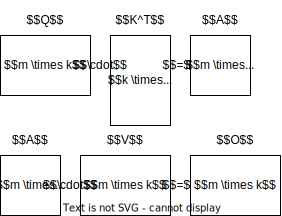

# Pytorch Window Matmul

## Description

This repository contains a custom PyTorch CUDA kernel for batched windowed matrix multiplication. This is particularly useful for the windowed local attention in sparse attention transformer models such as [BigBird](https://proceedings.neurips.cc/paper/2020/hash/c8512d142a2d849725f31a9a7a361ab9-Abstract.html) and [Longformer](https://arxiv.org/abs/2004.05150). Given two matrices $Q$ and $K$ of size (B, M, N) and (B, N, M) it computes the windowed diagonal of the batched matrix product $QK = A$ for a window size $w$. An entry $a_{i,j} = \sum_{k=1}^N Q_{i,k} \cdot K_{k,i + j - w}$ and $A$ has size (B, M, 2w + 1). The image below gives an example for M = 10 and $w$ = 2. The window extends $w$ entries to left and right of the diagonal. Any entries outside the window are set to zero.



To complete the windowed attention operation, the attention matrix $A$ needs to be multiplied with another matrix $V$. Here the windowed matrix needs to unraveled and multiplied with the correct windowed entries in $V$. We call this the "unwindow" operation. An entry of the output matrix $O$ is given by $o_{i,k} = \sum_{j=1}^{2w + 1} a_{i,j} \cdot v_{i + j - w, k}$ and $O$ has size (B, M, N).


## Installation and Usage

To install the package run

```bash
pip install git+https://github.com/webis-de/pytorch-window-matmul.git
```

An example on how to use the kernel:

```python
import torch
import window_matmul

# create some random matrices
batch_size = 2
seq_len = 10
hidden_size = 5
window_size = 2
q = torch.rand(batch_size, seq_len, hidden_size)
k = torch.rand(batch_size, hidden_size, seq_len)
v = torch.rand(batch_size, seq_len, hidden_size)

# compute windowed attention
a = window_matmul.window_matmul(q, k, window_size)

assert a.shape[-1] == 2 * window_size + 1

# compute output
o = window_matmul.unwindow_matmul(a, v, window_size)

```

NOTE: The cpu version is not optimized and is only for reference. The cuda version is optimized and is the one to use.

## Benchmark

Super slow for large batch sizes.
