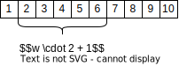
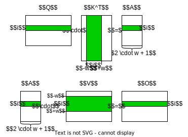

# Banded Matrix Multiplication for Windowed Attention in Transformers

Transformer-based models use dot-product attention to let different items of a sequence interact with one another. Leaving out auxiliary functions, the attention mechanism boils down to two dot-products between three matrices: $(Q \cdot K^T) \cdot V$. All matrices are of shape $(m \times k)$, where $m$ is the sequence length and $k$ is the hidden dimension. This allows all $m$ items of a sequence to attend to each other.


In windowed attention, the interactions between items is restricted to a window around an item. That is, an item can only attend to $w$ items around itself. In the example below, for a window size of $w=2$, the fourth element can only attend to its two neighbors to the left and right of itself.



The windowed attention mechanism requires two banded matrix-matrix multiplication operations. The first is the multiplication between $Q$ and $K^T$. Instead of the the full output matrix, only the diagonal as well as the $w$ bands to the left and right of the diagonal need to be computed. $A$ then has the shape $(m \times 2 \cdot w + 1)$. The banded-matrix $A$ then needs to be multiplied with the non-banded matrix $V$. Formally, the operation can be described as:

$Q_{s \times h} \boxdot_w K_{s \times h}^T \rightarrow A_{s \times 2 w + 1}$

$a_{i,j} =  \sum_{k=1}^h q_{i,k} \cdot k_{k,i + j - w - 1}$

$A_{s \times 2w+1} \odot_w V_{s \times h} \rightarrow O_{s \times h}$ 

$o_{i,k}= \sum_{j=1}^{2w+1} p_{i,j} \cdot v_{i + j - w - 1,k}$

In words, both operations involve multiplying a row-vector from the first factor of the dot-product with the correct sub-matrix of the second factor. A visual example is given below.



Naively, both operations can be implemented in pytorch like so:

```python
def python_window_matmul(
    Q: torch.Tensor, K: torch.Tensor, window_size: int
) -> torch.Tensor:
    seq_len, hidden_dim = Q.shape
    K_t = K.T
    A = torch.zeros(seq_len, window_size * 2 + 1)
    for s in range(seq_len):
        for w in range(max(0, s - window_size), min(seq_len, s + window_size + 1)):
            w_idx = w - min(0, s - window_size) - max(0, s - window_size)
            for k in range(hidden_dim):
                A[s, w_idx] += Q[s, k] * K_t[k, w]
    return A

def python_unwindow_matmul(A: torch.Tensor, V: torch.Tensor, window_size: int) -> torch.Tensor:
    seq_len, hidden_dim = V.shape
    O = torch.zeros_like(V)
    for s in range(seq_len):
        for w in range(max(0, s - window_size), min(seq_len, s + window_size + 1)):
            w_idx = w - min(0, s - window_size) - max(0, s - window_size)
            for k in range(hidden_dim):
                O[s, k] += A[s, w_idx] * V[w, k]
    return O
```

A more computationally efficient implementation of the first operation using einsum first creates a view over $K$. For each item in the sequence, the correct sub-matrix is then contained in a new dimension. $K$ then has the shape $(m \times 2 \cdot w +1 \times k)$. For example:

```python
def to_windowed(
    hidden_states: torch.Tensor,
    attention_window_size: int,
    pad: bool = True,
) -> torch.Tensor:
    if not attention_window_size:
        return hidden_states.unsqueeze(2)
    if pad:
        padding = (attention_window_size - 1) // 2
        hidden_states = torch.nn.functional.pad(hidden_states, (0, 0, padding, padding))
    *sizes, seq_len, hidden_dim = hidden_states.size()
    num_windows = max(seq_len, attention_window_size) - attention_window_size + 1
    new_stride = tuple(list(hidden_states.stride()[:-1]) + [hidden_dim, 1])
    new_shape = (
        *sizes,
        num_windows,
        attention_window_size,
        hidden_dim,
    )
    return hidden_states.as_strided(new_shape, new_stride)

>>> to_windowed(torch.arange(15).view(5,3), 2).shape
torch.Size([4, 2, 3])
>>> tensor = to_windowed(torch.arange(15).view(5,3), 2)
>>> tensor.shape
torch.Size([4, 2, 3])
>>> tensor
tensor([[[ 0,  1,  2],
         [ 3,  4,  5]],

        [[ 3,  4,  5],
         [ 6,  7,  8]],

        [[ 6,  7,  8],
         [ 9, 10, 11]],

        [[ 9, 10, 11],
         [12, 13, 14]]])
```

The operations can then be defined as:

```python
def pytorch_window_matmul(
    Q: torch.Tensor, K: torch.Tensor, window_size: int
) -> torch.Tensor:
    windowed_K = to_windowed(K, window_size * 2 + 1)
    out = torch.einsum("...mk,...mwk->...mw", Q, windowed_K)
    return out

def pytorch_unwindow_matmul(
    A: torch.Tensor, V: torch.Tensor, window_size: int
) -> torch.Tensor:
    windowed_V = to_windowed(V, window_size * 2 + 1)
    out = torch.einsum("...mw,...mwk->...mk", A, windowed_V)
    return out
```

Unfortunately, this does not work for the batched case, necessary for training a language model. In this case, $Q$, $K$, and $V$ have shape $(b \times m \times k)$. For the first operation (indentically for the second operation), $K$ would then have the dimension $(b \times m \times 2 \cdot w + 1 \times k)$. To align the multiplications, under the hood, PyTorch then expands $Q$ to the shape $(b \times m \times 1 \times k)$. The operation therefore multiplies a $(b \times m \times 1 \times k)$-shaped matrix with a $(b \times m \times 2 \cdot w + 1 \times k)$-shaped matrix. Using CUDA (not tested for other devices or frameworks), the a batched matrix multiplication kernel is used that only supports 3-dimensional tensors. This means that all dimensions but the last two of $Q$ and $K$ get reduced into the first dimension. $Q$ turns into a $(b \cdot m \times 1 \times k)$ matrix and $K$ into a $(b \cdot m \times 2 \cdot w + 1 \times k)$ matrix. Since the second-to-last dimension of $K$ is however a view over the sequence length, this dimension reduction cannot be done in a contiguous tensor. The entire tensor needs to be copied, leading to a substantial memory footprint given $m$ is large. The code snippet below illustrates the problem:

```python
def humanbytes(B):
    """Return the given bytes as a human friendly KB, MB, GB, or TB string."""
    B = float(B)
    KB = float(1024)
    MB = float(KB**2)  # 1,048,576
    GB = float(KB**3)  # 1,073,741,824
    TB = float(KB**4)  # 1,099,511,627,776

    if B < KB:
        return "{0} {1}".format(B, "Bytes" if 0 == B > 1 else "Byte")
    elif KB <= B < MB:
        return "{0:.2f} KB".format(B / KB)
    elif MB <= B < GB:
        return "{0:.2f} MB".format(B / MB)
    elif GB <= B < TB:
        return "{0:.2f} GB".format(B / GB)
    elif TB <= B:
        return "{0:.2f} TB".format(B / TB)


batch_size = 32
m = 512
k = 128
window_size = 64

X = torch.randn(batch_size, m, k).cuda()
Y = torch.randn(batch_size, m, k).cuda()
window_Y = to_windowed(Y, window_size)

torch.cuda.reset_peak_memory_stats()
matmul_out = torch.matmul(X, Y.transpose(-1, -2))
matmul_max_mem = torch.cuda.max_memory_allocated()
print(f"matmul_max_mem: {humanbytes(matmul_max_mem)}")

torch.cuda.reset_peak_memory_stats()
einsum_out = torch.einsum("...ij,...ilj->...il", X, window_Y)
einsum_max_mem = torch.cuda.max_memory_allocated()
print(f"einsum_max_mem: {humanbytes(einsum_max_mem)}")

torch.cuda.reset_peak_memory_stats()
strided_out = torch.matmul(X.unsqueeze(-2), window_Y.transpose(-1, -2)).squeeze(-2)
strided_max_mem = torch.cuda.max_memory_allocated()
print(f"strided_max_mem: {humanbytes(strided_max_mem)}")

assert torch.allclose(einsum_out, strided_out)

torch.cuda.reset_peak_memory_stats()
dummy = torch.randn(batch_size * m, window_size * 2 + 1, k).cuda()
dummy_max_mem = torch.cuda.max_memory_allocated()
print(f"dummy_max_mem: {humanbytes(dummy_max_mem)}")

# throws error!
# tensor is not contiguous and gets copied into contiguous tensor inside matmul
window_Y.view(-1, window_size * 2 + 1, k)
```

Executing the above script as `test_strided.py` gives the following output:

```bash
$ python test_strided.py
matmul_max_mem: 58.00 MB
einsum_max_mem: 1.07 GB
strided_max_mem: 1.08 GB
dummy_max_mem: 1.08 GB
Traceback (most recent call last):
  File "/mnt/ceph/storage/data-tmp/2022/fschlatt/window_matmul/test_strided.py", line 70, in <module>
    window_Y.view(-1, window_size * 2 + 1, k)
RuntimeError: view size is not compatible with input tensor's size and stride (at least one dimension spans across two contiguous subspaces). Use .reshape(...) instead. 
```

TLDR: einsum does not do batched matrix multiplication over n-dimensional tensors in place. It reduces the input tensors to 3-dimensions, which is not compatible with the strided view required for the windowed matrix multiplication operation.
